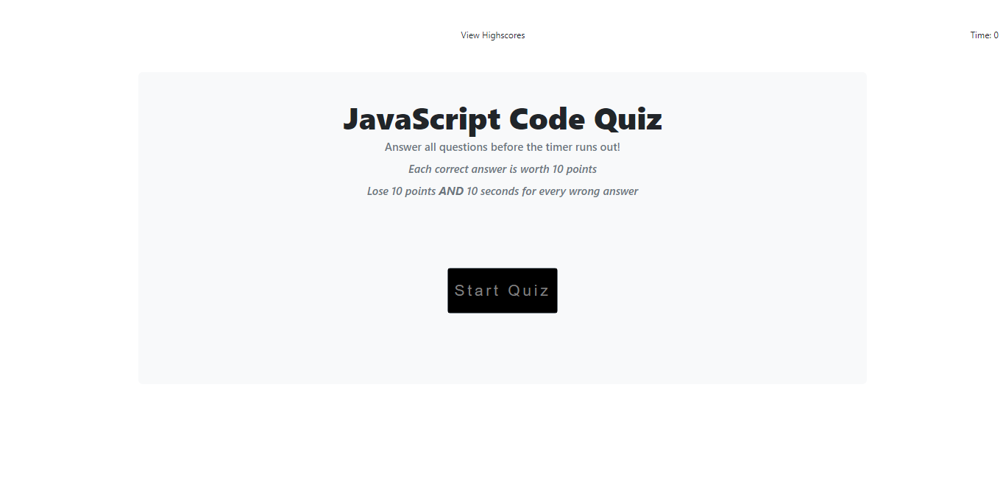
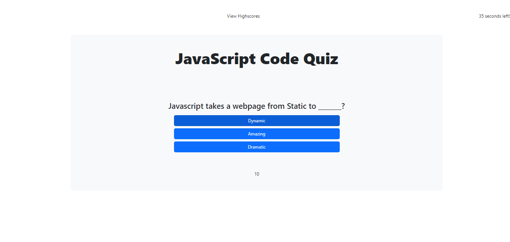

# TestTime

  

  ## Description
  This project is a timed, multiple choice coding quiz.

  ## Table of Contents
  - [Installation Instructions](#Installation)
  - [Usage Information](#Usage)
  - [Contribution Guidelines](#Contribution)
  - [Test Instructions](#Test)
  - [Questions](#Questions)
  - [License](#License)
  
  ## Acceptance Criteria
  * GIVEN I am taking a code quiz
  * WHEN I click the start button
  * THEN a timer starts and I am presented with a question
  * WHEN I answer a question
  * THEN I am presented with another question
  * WHEN I answer a question incorrectly
  * THEN time is subtracted from the clock
  * WHEN all questions are answered or the timer reaches 0
  * THEN the game is over
  * WHEN the game is over
  * THEN I can save my initials and score
  ## Installation
  There are no requirements. Just enter the project url into a web browser address bar and start the quiz.

  ## Usage
  This was created for a homework challenge. It will be used as a mock interview assessment quiz. The problem solved is, preparing me for a career in software development by building my skills and readiness.
  
  
  
  
  ## Contribution
  I was the only contributor. Contact me by email if you are interested in contributing.

  ## Test
  This project can be tested by actually taking the quiz and seeing the functionality. 

  ## Questions?
  - Github link: https://github.com/ampatte
  - Email link: ampatte717@gmail.com

  ## License
    This project is covered under the MIT license.(https://choosealicense.com/licenses/mit/)
